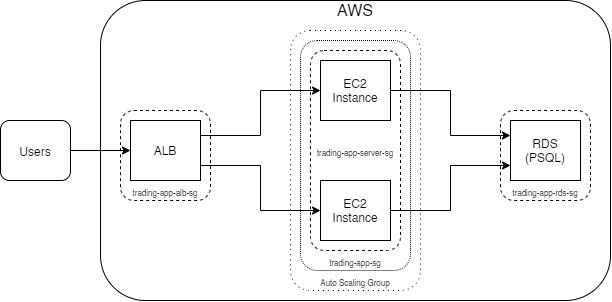
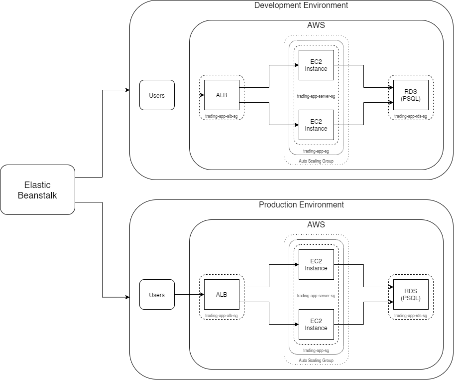
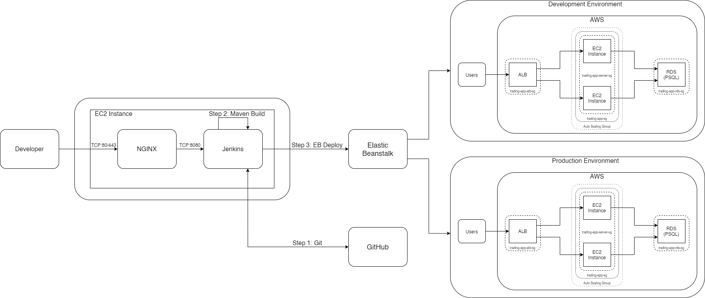

# Cloud & DevOps Project
## Introduction
The purpose of this project was to host the previously created [SpringBoot](https://github.com/jarviscanada/jarvis_data_eng_DaydeReid/tree/master/springboot)
application on the cloud, as well as automate the deployment process for it. Since the trading app features a three-tier
microservice architecture, being divided into Presentation, Application, and Data tiers, it was able to make great use of 
Amazon Web Service's Application Load Balancers and Auto Scaling Groups, creating new EC2 instances to host the Application tier as needed, with
a single RDS to share the database between them. Additionally, to avoid having to provision all of these AWS resources
manually, Elastic Beanstalk was used to create and manage different environments. To further automate the application,
a CI/CD pipeline was created using Jenkins to pull updated versions from GitHub, build them, and send them to each environment
managed by Elastic Beanstalk.

## Application Cloud Architecture

To ensure the workload from users of the app was properly divided between the various EC2 instances in the app, an
Application Load Balancer was provisioned. This acts as a layer between the user and the application instances, redirecting
requests to different EC2 instances so that their workloads remain balanced. Additionally, the ALB also helps handle
instances which have crashed, by not forwarding any requests to instances which it determines to be unhealthy.
The application also manages to be both elastic and scalable through use of an Auto Scaling Group attached to the ALB.
This ASG automatically creates and removes EC2 instances to meet the demand placed on the ALB, scaling up when needed,
while still being elastic.

## Deployment Environments
When working on a web application which has already gone live, it is important to have multiple environments for
different versions of the application to run on. For example, one environment might hold the current, in-production
version of the app, while another might hold the development version which is currently being worked on. This way,
potentionally buggy development code is not pushed to the live version of the application. To automate the creation of
these environments, Elastic Beanstalk was used. Elastic Beanstalk handles the provisioning of all resources needed
in the environments.

## Jenkins Server

## Jenkins CI/CD pipeline
Creating the Jenkins CI/CD pipeline was a multi-step process. First, on a Ubuntu EC2 separate from the Elastic Beanstalk environments, I created an NGINX reverse proxy. This automatically
forwards all HTTP traffic (port 80) to the Jenkins server (port 8080). Next, I installed and set up some plugins in Jenkins. I set the location of the JDK, Git, and Maven within the instance, so
that Jenkins could use them. After that, I created the Jenkinsfile, which defined the CI/CD pipeline.

The steps of the pipeline itself can be seen in the Jenkins Server diagram above. First, Jenkins pulls the updated version of the application from GitHub. It then uses Maven to build a deployable
.jar from the pulled code. Finally, a bash script is ran, which uses Elastic Beanstalk console commands to deploy the created .jar in the proper environment, based on the Git branch which the
code was originally pulled from.

## Improvements
1. Set up some sort of way to have Jenkins automatically detect new commits to branches it uses to set up environments
2. Change the branches that Jenkins tracks from a feature branch and develop for development/production environments to develop and master
3. Make the development environement private in some way