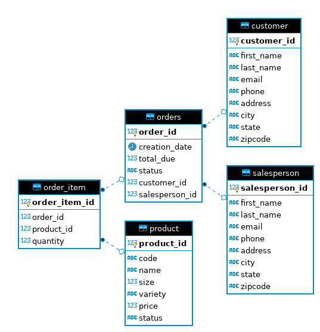

# JDBC
## Introduction
This app served as a tool for learning basic JDBC functionality. It two basic DAO
implementations for a simple database focused mainly on Customers and Orders they have
placed, with other tables of fields relating to the orders, such as Salespersons
responsible for the sale and the Products the contain. The two DAOs are as follows: A
simple one for Customers, which contains full CRUD functionality, and a more complicated
one for Orders which only features reading.

## ER Diagram

## Design Patterns
This app uses the DAO design pattern for its JDBC functionality. Data Access Objects work
best for  databases like this one, as the DAO allows for database joins to be performed in
the object itself. Because this database is fully centralised, these complex joins can be
performed with relative ease.

If the database needed to be scaled more horizontally, resulting in a more distributed
system, then it would make less sense to use the DAO pattern, as trying to do joins in a
database that is spread out over multiple devices can take a lot of time. As such, it would
be best to switch to the Repository pattern, which only operate on a single table at a time. This way the joins can be done after the data has been selected, once it has been collected from the various different sources. 

Something to note is that while the CustomerDAO is indeed intended to be a DAO, the fact that
it performs no joins of its own during its operations means it could also be considered an
implementation of the Repository design pattern.
