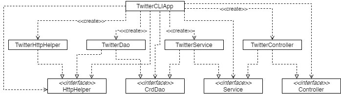

# Twitter CLI App

## Introduction
The Twitter CLI App is a Java-based app which can post, view and delete tweets from the
command line. It uses a basic MVC architecture, and directly interacts with the Twitter REST
API to perform its tasks. Completing this app required learning the Mockito framework for unit
testing, as well as the Spring framework for dependency management.

## Quick Start
Before running the app, you must first ensure several environmental variables have been added:

- The Twitter Consumer API Key (as consumerKey)
- The Twitter Consumer API Secret Key (as consumerSecret)
- The Twitter Access Token (as accessToken)
- The Twitter Access Token Secret (as tokenSecret)

These values will be used by the app to perform the proper authentication needed to use the
Twitter API.

Once the environment variables have been set up, create the `.jar` file with Maven by using `mvn package`
The app can be ran from the `.jar` file. There are three modes in which the app can be ran:

Mode | Description
--- | ---
`java -jar [.jar file] post "tweet text" "latitude:longitude"` | Post a new tweet with the given text and the specified latitude and longitude for location data, then print the newly created tweet out in JSON form
`java -jar [.jar file] show "id"` | Print out the tweet with the given ID in JSON form
`java -jar [.jar file] delete "id1,id2,id3...` | Delete the tweets with the given comma-separated IDs and print them in JSON form

## Design

Breakdown of main components:

Component | Purpose
--- | ---
TwitterCLIApp | The main part of the app that initializes alll other components and dependencies, and passes the command line inpput to the controller
TwitterController | The controller parses user input from the command line, ensuring it is formatted correctly before passing it on to the service layer
TwitterService | The service layer handles the business logic, such as ensuring arguments are in the correct format for the DAO, before calling the DAO itself
TwitterDao | The Data Access Layer, it interacts directly with the Twitter REST API to create Tweet models for the app to use

## Spring
As part of this project was to learn the Spring framework, there are three different
implementations of Spring to handle the dependencies.

The first implementation (`TwitterCLIBean`) uses manually set `@Bean` annotations to indicate
dependencies for the application context to fulfil.

The second implementation (`TwitterCLIComponentScan`) automatically scans the entire Twitter
project for all dependencies for the application context to fulfill

The third implementation (`TwitterCLISpringBoot`) uses Spring Boot's extended Spring
implementation so that the extensive boilerplate from Spring is not needed

## Models
The main model used in this app is the Tweet model. It is a simple POJO which contains a 
selection of values from Twitter's own Tweet objects, as well as some nested models. The
Tweet model is also the DTO used throughout the entire app.

## Improvements
- Add an optional parameter for showing tweets to only show specified fields
- Allow showing a tweet to get multiple tweet IDs like delete does
- Add functionality to posting a tweet for including attachments