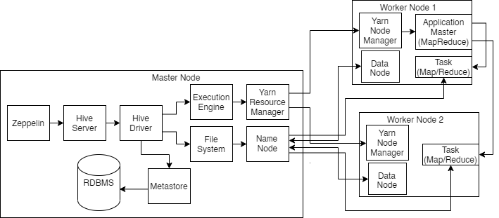

# Hadoop Project
## Table of contents
* [Introduction](#introduction)
* [Hadoop Cluster](#hadoop-cluster)
* [Hive Project](#hive-project)
* [Improvements](#improvements)

# Introduction
The purpose of this project was to evaluate different big data tools. Specifically, Core Hadoop was evaluated, as well as
its main components: MapReduce, HDFS, and YARN. To help with the evaluation process, a Hadoop Cluster was provisioned
using Google Cloud Computing. This allowed for sample queries to be performed on sample data (In this case, the WDI
dataset) to test out fuctionality for Hadoop-based software such as Apache Hive. All of these sample queries were
recorded within a Zeppelin notebook, for later viewing. Through this evaluation, it was found that while Hadoop was 
traditionally used through the creation of MapReduce queries, the SQL-like queries which Hive allows for have all but
replaced that.

# Hadoop Cluster

The interface used in the project to perform the evaluations was Zeppelin. Zeppelin used the Hive Server to communicate
with the Hive Driver, which in turn used three systems to perform the specified queries: The Metastore, which uses an
RDBMS to store Hive metadata, the File System, in this case HDFS, which contains all the data available to be processed,
and the Execution Engine, which is what actually interacts with the Hadoop cluster. The Hadoop cluster is managed using
YARN, which has a Resource Manager on the master node that communicates with Node Managers on each of the worker nodes.
These worker nodes contain an Application Master, which is responsible for dividing up the job defined by the query into
tasks to be performed on the worker nodes.

# Hive Project
- discuss the purposes of the project and what you have done.

# Improvements
1. Spend more time with the columnar file types, to better determine when they should or should not be used
2. Experiment with more worker nodes to see how much faster they will make queries
3. Try using a different, larger dataset to determine if my theory on why the Hive query for counting countries took as
long as just using Bash was correct