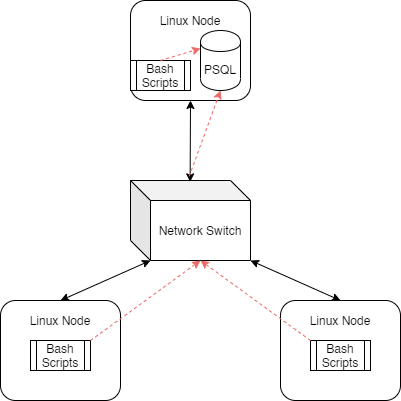

# Linux Cluster Monitoring Agent
## Introduction
The Linux Cluster Monitoring Agent is a tool which allows users to monitor resource usage statistics
for multiple nodes within a Linux cluster. It consists of a series of scripts that will initialize a
PSQL database within a Docker container, which the agent will then use to store hardware
specifications and usage data for each node in the cluster. Hardware and usage data is collected and
populated into the database via the bash scripts within the agent, with usage data being recorded
every minute, to allow users to generate resource usage reports and inform resource planning with
data collected in real time.

## Quick Start
```bash
# Use the psql_docker script to create a PSQL instance with the given user
./scripts/psql_docker.sh create [db_username] [db_password]

# Create the host_info and host_usage tables in the database using ddl.sql
psql -h localhost -U [db_username] -d host_agent -f sql/ddl.sql
# db_password required

# Insert host hardware specifications into the database using the host_info script
./scripts/host_info.sh [psql host] [port] host_agent [db_username] [db_password]

# Insert host usage statistics into the database using the host_usage script
./scripts/host_usage.sh [psql host] [port] host_agent [db_username] [db_password]

# Automate collection of usage statistics using crontab job
crontab -e
# In the editor which opens, add the line below to collect usage statistics every minute
* * * * * bash [full/path/to]/linux_sql/scripts/host_usage.sh [psql host] [port] host_agent [db_username] [db_password] &> /tmp/host_usage.log
```

## Architecture Diagram


Each Linux node is connected through a switch. One node has the PSQL instance, and thus can send the results from its scripts directly to it. The other nodes must send their results through the switch to get to the database.

## Database Modeling
The `host_agent` database contains two tables:

The `host_info` table contains hardware specifications for the host in which the script was ran

Field | Description
--- | ---
`id` | Auto-incremented unique identifier for the host
`hostname` | The name for the host, also needs to be unique
`cpu_number` | The number of cores the CPU has
`cpu_architecture` | The architecture of the CPU
`cpu_model` | The name of the CPU model
`cpu_mhz` | The clock speed of the CPU, in MHz
`L2_cache` | The size of the L2 cache, in KB
`total_mem` | The total amount of memory in the node
`timestamp` | When these specifications were taken

The `host_usage` table contains usage statistics for the host in which the script was ran

Field | Description
--- | ---
`timestamp` | When these statistics were taken
`host_id` | The ID of the corresponding host_info entry
`memory_free` | The amount of free memory in the node
`cpu_idle` | The percentage of time that the CPU is idle
`cpu_kernel` | The percentage of time the CPU is running kernel code
`disk_io` | The number of disks currently undergoing I/O processes
`disk_available` | Available space in the disk's root directory, in MB

## Scripts
The `psql_docker` script manages the PSQL Docker instance

```
# Provisions and starts a PSQL Docker instance, creating the specified user within
./scripts/psql_docker.sh create [db_username] [db_password]

# Start/stop the Docker instance
./scripts/psql_docker.sh [start | stop]
# Need to ensure the Docker instance has be created
```

The `ddl.sql` script handles creating the database tables needed for the agent
```
# Create the host_info and host_usage tables in the host_agent database
psql -h localhost -U [db_username] -d host_agent -f sql/ddl.sql
# db_password required, also assumes host_agent database already exists
# Docker instance needs to be running
```

The `host_info` script gets host hardware specifications and adds the to the database
```
# Get hardware specifications and insert them into the host_info table
./scripts/host_info.sh [psql host] [port] host_agent [db_username] [db_password]
# Where: 
# psql host is the connection to the PSQL instance
# port is the port to connect to
# db_username/password are from the user created along the instance
# Assumes that the host_info table already exists within the host_agent database
# Docker instance needs to be running
# Only needs to be ran once per host
```

The `host_usage` script gets host usage statistics and adds them to the database
```
# Get usage statistics and insert them into the host_usage table
./scripts/host_usage.sh [psql host] [port] host_agent [db_username] [db_password]
# Where: 
# psql host is the connection to the PSQL instance
# port is the port to connect to
# db_username/password are from the user created along the instance
# Assumes that the host_usage table already exists within the host_agent database
# Docker instance needs to be running
# Should be run multiple times for continuous updates

# Can automate host_usage using crontab jobs
crontab -e
# In the editor which opens, add the line below to collect usage statistics every minute
* * * * * bash [full/path/to]/linux_sql/scripts/host_usage.sh [psql host] [port] host_agent [db_username] [db_password] &> /tmp/host_usage.log
# Can ensure job is running using
crontab -l
# Results are logged in /tmp/host_usage.log
```

The `queries.sql` script contains multiple queries which can be used to inform resource allocation

The first query can be used to group hosts together by their CPU count, and view their memory size in descending order

The second query will determine the average memory usage for each host, divided into 5 minute periods

[WIP] The last query determines if any of the nodes have failed, by reporting any of them that have missed three or more `host_usage` updates in a row

## Future Improvements
- Complete query that checks for failed nodes
- Add additional queries to allow for different kinds of analysis
- Devise a way to keep hardware specifications up to date