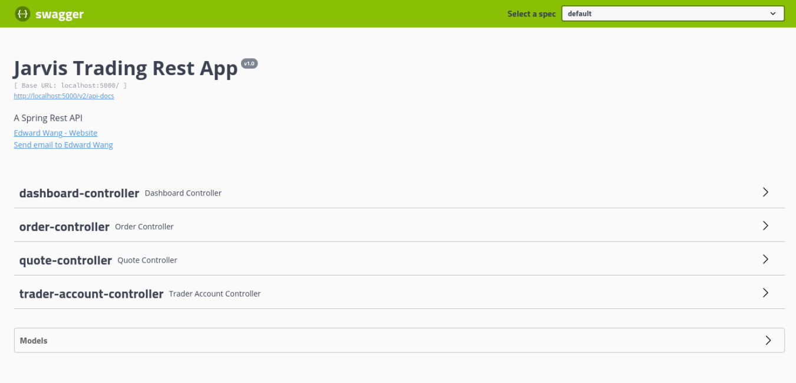

Table of contents
* [Introduction](#Introduction)
* [Quick Start](#Quick Start)
* [Architecture](#Architecture)
* [REST API Usage](#REST API Usage)
* [Docker Deployment](#Docker Deployment)
* [Improvements](#Improvements)

# Introduction
The Jarvis Trading App is an online stock trading simulation. It uses a REST API create and manage trader accounts, which can then be used to make market orders for various
stocks which have been added to the daily list. The API can be interacted with directly for use by front-end and mobile developers, but can also easily be used by traders
themselves due to the easy-to-use Swagger UI. The app itself follows the Microservice architecture, using Spring Boot for dependency injection as well as the Tomcat web
servlet it provides. All application information, including trader accounts, quotes in the daily list, and submitted market orders, are stored within a PSQL database, while
the quote information for the stocks themselves are pulled from IEX Cloud's API.

# Quick Start
Prerequisites:
- CentOS 7
- Docker version 17.05 or higher

The application can easily be started using Docker.

1. Create a Docker network to connect the container which contains the database with the container running the app
   ```bash
   sudo docker network create trading-net
   ```
2. Build the Docker images from the provided Dockerfiles
   ```bash
   # PSQL Image
   cd ./springboot/psql
   docker build -t trading-psql .
   
   # Trading App Image
   cd ./springboot
   docker build -t trading-psql .
   ```
3. Start the PSQL container and attach it to the created network
   ```bash
   docker run --name trading-psql-dev \
   -e POSTGRES_PASSWORD=password \
   -e POSTGRES_DB=jrvstrading \
   -e POSTGRES_USER=postgres \
   --network trading-net \
   -d -p 5432:5432 trading-psql
   ```
4. Start the trading app container and also attach it the the network
   ```bash
   # Set credential obtained from IEX
   IEX_PUB_TOKEN="your_token"
   
   # Start the container
   docker run --name trading-app-dev \
   -e "PSQL_URL=jdbc:postgresql://trading-psql-dev:5432/jrvstrading" \
   -e "PSQL_USER=postgres" \
   -e "PSQL_PASSWORD=password" \
   -e "IEX_PUB_TOKEN=${IEX_PUB_TOKEN}" \
   --network trading-net \
   -p 5000:8080 -t trading-app
   ```
The API should now be accessible on localhost port 5000.

Alternatively, got to http://localhost:5000/swagger-ui.html to use the Swagger UI as shown below:



# Architecture


The trading app follow a three layer architecture. The layers are as follows:

The **Controller Layer** is responsible for accepting user input. It does so through multiple REST API endpoints. The data which the controllers get from the API requests is then passed to the Service Layer, after being converted into a more usable form.

The **Service Layer** handles all the business logic. After receiving data from the controller layer, it performs tasks like validating the input, and ensuring that the resources that are being requested actually exist within the data source. Once everything has been confirmed, the DAO Layer is called to actually complete the task.

The **DAO Layer** directly interacts with the data sources, those being the PSQL database, and IEX. It fetches and saves data from and to them as requested.

Other additional components of the app that are of note:

**Spring Boot** and it's Inversion of Control functionality are used to manage the dependency injection for the entire application. In addition, the Tomcat webservlet it provides is used tp handle the API REST requests.

**PSQL** and **IEX** are the sources of all data for the app. IEX is used to fetch actual stock quote information, which is then stored in the quote table within the PSQL database to create the daily list for trading. In addition to the daily list, the PSQL database also contains tables for trader and account data, a table for security orders, and a view for seeing a trader's current position for a stock.

# REST API Usage
## Swagger
Swagger is a tool used to automatically read a project's API structure, and create interactive API documentation from it. Swagger is used in this project as it creates an easy-to-use UI, which can be used to test the various endpoints in the application directly from the browser.

## Quote Controller
The controller for all things quote related. Contains endpoints for fetching quote market data directly from IEX, caching it within a PSQL database, and updating existing quotes with the database.

The Quote Controller has the following endpoints:

Endpoint | Description
--- | ---
GET `/iex/ticker/{ticker}` | Show the full quote information for the security with the given `{ticker}`, pulled from IEX
POST `/tickerId/{tickerId}` | Add the security with the given `{tickerId}` to the daily list by caching its quote in the database, thus making it tradable in the app
GET `/quote/dailyList`| List all of the securities available to be traded within this trading system. That is, all securities which have had their quotes previously cached in the database
PUT `/iexMarketData` | Update the cached quote information for all securities in the daily list by fetching the updated information from IEX
POST `/` | Take a Quote object passed in the request body and insert it directly into the quote table in the PSQL database

## Trader Account Controller
This controller contains endpoints for creating and deleting traders and their accounts, both of which are stored in PSQL database tables. There are also endpoints for manipulating the amount of funds in a trader's account.

The Trader Account Controller has the following endpoints:

Endpoint | Description
--- | ---
POST `/firstname/{firstname}/lastname/{lastname}/dob/{dob}/country/{country}/email/{email}` | Create a new trader for the given information, saving it into the database alongside an account that is tied to the trader
POST `/` | Take a Trader object passed in the request body and insert it directly into the trader table in the PSQL tabe, along with a new account tied to the trader
DELETE `/traderId/{traderId}` | Delete the trader with the given `{traderId}`, as well as the account tied to it. Only works if the trader to delete's account is empty, and they currently have no open positions.
PUT `/deposit/traderId/{traderId}/amount/{amount}` | Deposit an `{amount}` of money into the account belonging to the trader with the given `{traderId}`. The amount to deposit must be a positive number.
PUT `/withdraw/traderId/{traderId}/amount/{amount}` | Withdraw an `{amount}` of money from the account belonging to the trader with the given `{traderId}`. The amount to withdraw must be a positive number, and cannot exceed the amount of money currently in the account.

## Order Controller
A controller which contains a single endpoint, for placing market orders for specific securities.

The Order Controller has the following endpoints:

Endpoint | Description
--- | ---
POST `/marketOrder` | Takes a MarketOrderDto passed in the request body, and attempts to perform either a buy or sell order using it, depending on the value of the size parameter (Positive size indicates a buy order, while negative size indicates a sell order). Fails if either the ticker or the account ID in the DTO is invalid, or if the account doesn't contain enough resources to make the requested order. 

## Dashboard Controller
This controller only contains GET endpoints, used to get different views pertaining to a given trader and their account.

The Dashboard Controller has the following endpoints:

Endpoint | Description
--- | ---
GET `/profile/traderId/{traderId}` | Show the profile of the trader with the given `{traderId}`. A profile consists of the trader's info, combined with all information about their account.
GET `/portfolio/traderId/{traderId}` | Show the portfolio of the trader with the given `{traderId}`. A portfolio consists of a list securities which the specified trader has position in. For each security in the list, it shows the ticker for that security, the trader's position for that security, and the current quote for the security.


# Docker Deployment


There are two Docker images used in this application:

The **trading-psql** image is based on the official postgres image. It is used to run the PSQL database instance. The tables in the database are initialized using an `.sql` script, which is copied into `/docker-entrypoint-initdb.d` within the container, where it is automatically ran when it the container is started.

The **trading-app** image is based on the openjdk:8-alpine image, using Alpine as a lightweight base OS and openjdk as an open source way of running the Java code. The `.jar` file is first compiled using a separate container that runs Maven, and then copied into the actual container itself, where it will be ran.

# Improvements
- Change orders so that they actually reflect the amount of shares available by having them adjust the ask and bid size of the quotes
- Automate the daily list updates
- Make all POST methods work both with objects passed in the request body and path variables, instead of having methods that are only one or the other
- Extend the Order Controller/Service/Dao to work with more orders in addition to the market ones
- Allow multiple order to be placed with one API call, similarily, make it so multiple quotes can be added to the daily list with one API call